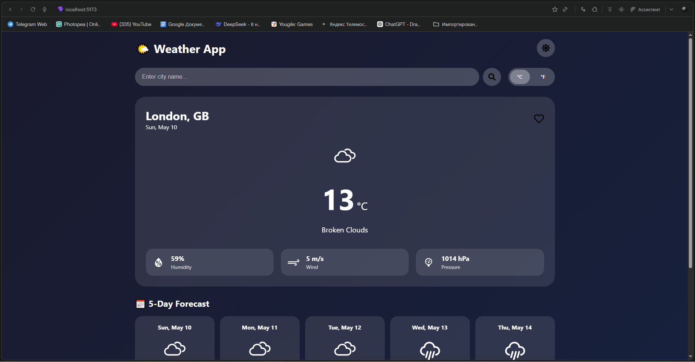
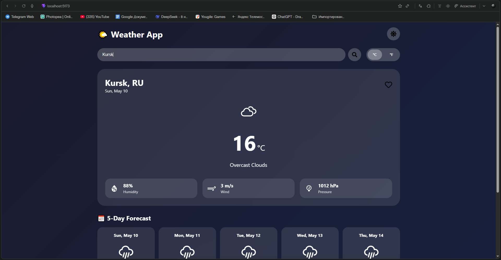
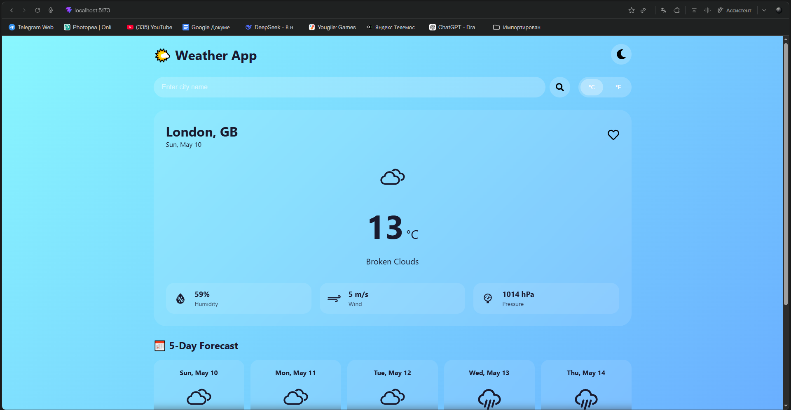
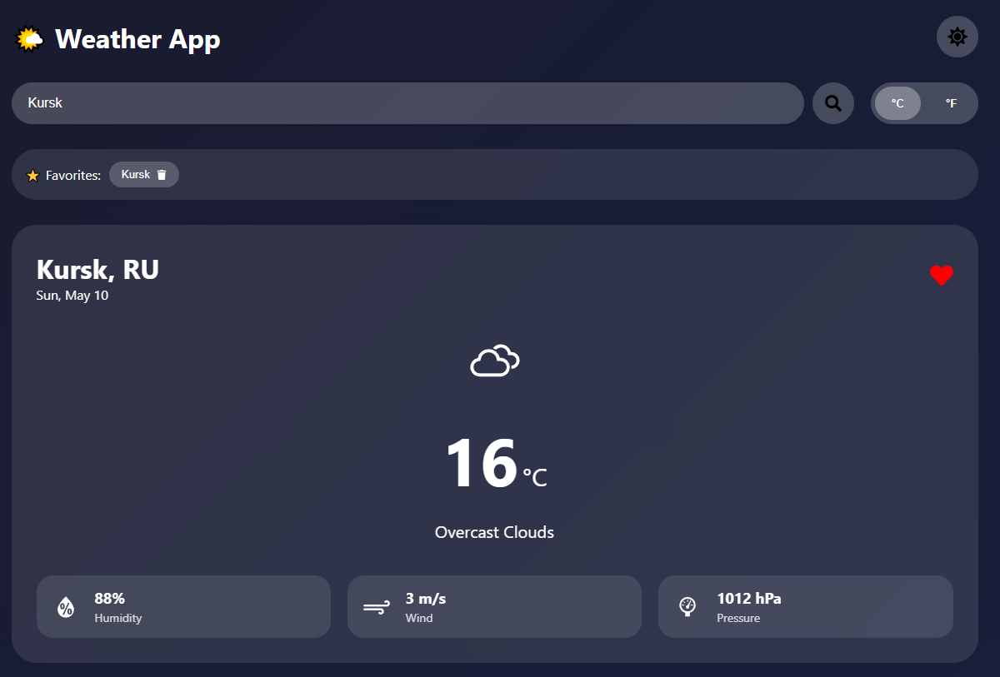

# 🌤️ React Weather App

<div align="center">


**Modern weather application with real-time data, 5-day forecast, and beautiful UI**

[📦 Installation](#-installation) | [🚀 Run](#-run) | [📖 Features](#-features) | [📸 Screenshots](#-screenshots)

</div>

---

## 📖 About

A beautiful and feature-rich weather application built with React and Vite. Get real-time weather data, 5-day forecasts, save favorite cities, and enjoy dark/light mode with smooth animations.

---

## ✨ Features

| Feature | Description |
|---------|-------------|
| 🌤️ Current Weather | Real-time temperature, humidity, wind speed, pressure |
| 📅 5-Day Forecast | Daily forecast with weather icons |
| 🔍 City Search | Search any city worldwide |
| ⭐ Favorites | Save your favorite cities |
| 🌡️ Unit Toggle | Switch between °C and °F |
| 🌓 Dark/Light Mode | Beautiful themes for day and night |
| 💡 Weather Tips | Helpful weather advice |
| 📱 Responsive | Works on desktop, tablet, and mobile |
| 💾 Local Storage | Saves favorites and settings |

---

## 🛠️ Tech Stack

- **React 18** - UI Framework
- **Vite** - Build Tool
- **Axios** - HTTP Requests
- **Framer Motion** - Animations
- **React Icons** - Icon Library
- **React Hot Toast** - Notifications
- **OpenWeatherMap API** - Weather Data

---

## 📦 Installation

### Prerequisites

- **Node.js** (v18 or higher) - [Download](https://nodejs.org/)
- **npm** (comes with Node.js)
- **OpenWeatherMap API Key** - [Get it here](https://openweathermap.org/api)

### Step 1: Create project

```bash
npm create vite@latest weather-app -- --template react
cd weather-app
```

## Step 2: Install dependencies

```bash
npm install
npm install axios react-hot-toast framer-motion react-icons
```

## Step 3: Get API key

Go to **OpenWeatherMap**

- Sign up / Login
- Navigate to **API Keys** tab
- Copy your key (looks like: `a1b2c3d4e5f6g7h8i9j0`)

## Step 4: Add API key

Open `src/App.jsx` and replace:

```javascript
const API_KEY = 'YOUR_API_KEY_HERE';
```

## 🚀 Run

```bash
npm run dev
```

Open [http://localhost:5173/](http://localhost:5173/) in your browser

## 🎯 Usage

### Search for a city

- Type city name in search bar
- Press Enter or click search button

### Add to favorites

- Click the heart icon on weather card
- Favorites appear in the top bar
- Click any favorite to view weather

### Change units

- Click °C or °F button in top right

### Toggle theme

- Click sun/moon button in header

### View forecast

- Scroll down to see 5-day forecast

## 📸 Screenshots

<div align="center">
  
  
  
  
</div>

## ⚙️ Available Scripts

| Command | Description |
|---|---|
| `npm run dev` | Start development server |
| `npm run build` | Build for production |
| `npm run preview` | Preview production build |

## 🌐 API Reference

Uses OpenWeatherMap API.

### Endpoints used

| Endpoint | Purpose |
|---|---|
| `/weather` | Current weather data |
| `/forecast` | 5-day forecast (3-hour intervals) |

### Parameters

| Parameter | Value |
|---|---|
| `q` | City name |
| `appid` | API key |
| `units` | `metric` (℃) or `imperial` (℉) |

## 🐛 Troubleshooting

| Problem | Solution |
|---|---|
| API key error | Wait 10-30 minutes for key activation |
| City not found | Check spelling, use English names |
| Port 5173 in use | Run `npm run dev -- --port 3000` |
| Blank page | Check console (F12) for errors |
| Styles not loading | Clear browser cache |

## 🔧 Customization

### Change default city

Edit `src/App.jsx`:

```javascript
const [city, setCity] = useState('London'); // Change 'London' to your city
```

### Change API language

Add `&lang=ru` for Russian:

```javascript
`https://api.openweathermap.org/data/2.5/weather?q=${cityName}&appid=${API_KEY}&units=${unit}&lang=ru`
```

### Add more weather tips

Edit `tips-list` in `App.jsx`:

```jsx
<div className="tip">🌡️ Your custom tip here</div>
```

## 📱 Responsive Design

| Breakpoint | Layout |
|---|---|
| `> 1200px` | Desktop (4 columns) |
| `768px - 1200px` | Tablet (2-3 columns) |
| `< 768px` | Mobile (1 column) |

## 🙏 Acknowledgments

- OpenWeatherMap for free weather API
- React Icons for beautiful icons
- Framer Motion for smooth animations
